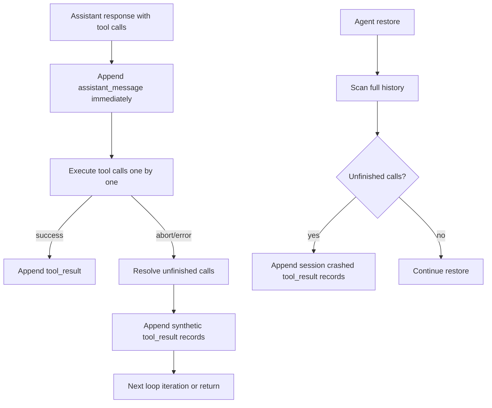

# Agent History Consistency

This change makes agent history durable and internally consistent when tool execution is interrupted.

## What changed
- Tool-related history records are now appended as they happen during the loop, not only at loop completion.
- Any unfinished tool calls are auto-completed with synthetic `tool_result` records:
  - `User aborted before tool completion.` when inference is aborted.
  - `Session crashed before tool completion.` when a session is restored with dangling calls.
- Dashboard history API now returns the full persisted stream (including pre-reset records).
- Reset behavior remains append-only: resets add markers, they do not delete history.

## Consistency flow

