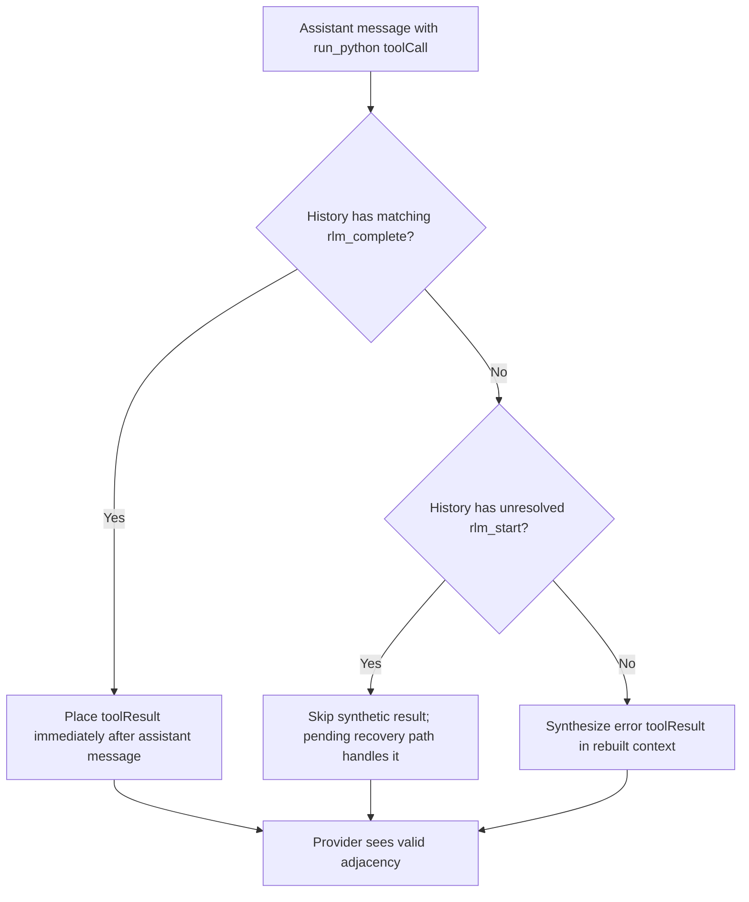

# Agent History Tool Result Pairing

## Problem

During restart recovery, Daycare can append synthetic `rlm_complete` records for pending `run_python` calls. Anthropic requires each `tool_result` to match a `tool_use` from the immediately previous assistant turn.

Two crash windows can break replay:

1. Assistant tool call is persisted, then process crashes before `rlm_start`.
2. Assistant + `rlm_start` are persisted, then process crashes before `rlm_complete`; recovery appends `rlm_complete` much later.

If replay emits late results in timeline position, or misses results entirely, Anthropic rejects with `unexpected tool_use_id`.

## Fix

`agentHistoryContext` now rebuilds tool results per assistant tool call, not by raw `rlm_complete` timeline position:

- For each assistant `run_python` tool call, replay matching `rlm_complete` immediately after that assistant message.
- If no `rlm_complete` exists and there is no unresolved `rlm_start`, synthesize an error result during replay.
- If `rlm_start` exists without `rlm_complete`, treat it as pending and do not synthesize (restore recovery handles it).

This keeps provider-visible tool-call adjacency valid while preserving append-only history.

## Flow

## Implementation

- `packages/daycare/sources/engine/agents/ops/agentHistoryContext.ts`
- `packages/daycare/sources/engine/agents/ops/agentHistoryContext.spec.ts`
