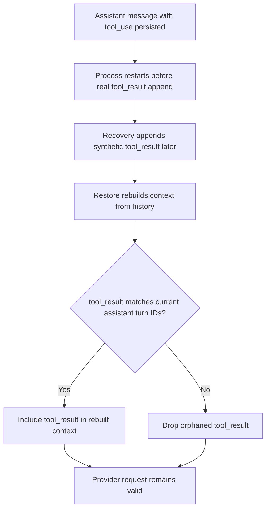

# Agent History Tool Result Pairing

## Problem

During restart recovery, Daycare can append synthetic `tool_result` records for pending tool calls. Anthropic requires each `tool_result` to match a `tool_use` from the immediately previous assistant turn.

If a synthetic result is replayed later without adjacency, Anthropic rejects the request with `unexpected tool_use_id`.

## Fix

`agentHistoryContext` now replays `tool_result` records only when they match tool calls from the current assistant turn and remain contiguous with that turn.

Any orphaned or delayed `tool_result` records are skipped while rebuilding inference context.

## Flow

## Implementation

- `packages/daycare/sources/engine/agents/ops/agentHistoryContext.ts`
- `packages/daycare/sources/engine/agents/ops/agentHistoryContext.spec.ts`
