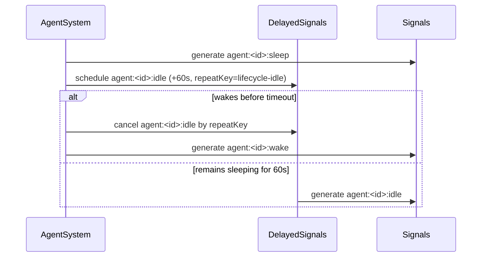

# Agent idle event

## Summary

The agent lifecycle now includes an `idle` phase. When an agent transitions to `sleeping`, the system schedules a delayed signal for 60 seconds later via the persistent delayed-signals queue.

If the agent wakes before the delay expires, the pending idle emission is canceled.

On successful idle transition, the engine emits lifecycle signal `agent:<agentId>:idle`.

## Lifecycle flow

