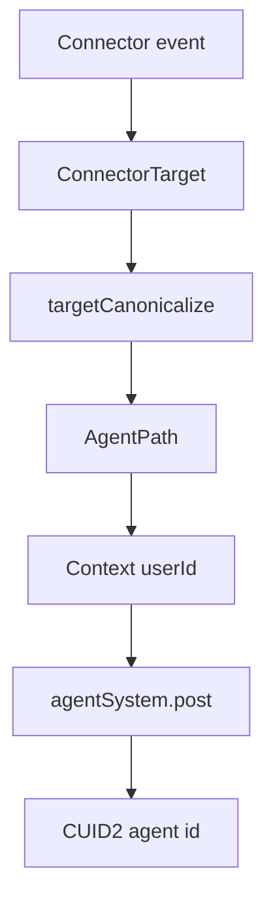
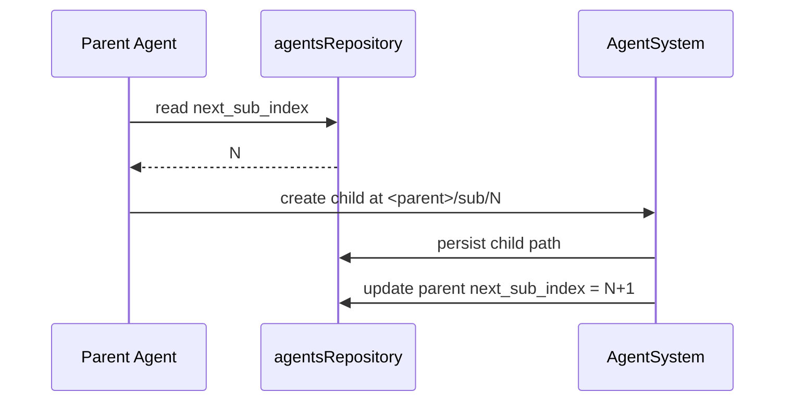

# Agent paths

Daycare now treats `path` as the canonical agent identity for routing.

Agent identity is split into:
- `path`: stable address (`/<userId>/...` or `/system/<tag>`)
- `config`: mutable metadata (`name`, `description`, `systemPrompt`, etc.)
- `id`: internal CUID2 runtime/storage key

Legacy descriptors are still supported as an input compatibility layer, but connector and command routing normalize to `path` before dispatch.

## Path patterns

```text
/<userId>/telegram
/<userId>/whatsapp
/<userId>/direct
/<userId>/agent/<name>
/<userId>/cron/<id>
/<userId>/task/<id>
/<userId>/subuser/<id>
/system/<tag>
<parent>/sub/<index>
<parent>/memory
<parent>/search/<index>
```

## Runtime normalization



## Subagent indexing

Each agent row persists `next_sub_index` for deterministic child path allocation.



## Storage layout

The `agents` table stores:
- `path TEXT` (active-row unique)
- `config TEXT` (JSON)
- `next_sub_index INTEGER NOT NULL DEFAULT 0`

This allows path-based resolution without unpacking descriptor payloads.

## Current compatibility boundary

- Connectors may still deliver descriptor targets in tests or legacy adapters.
- Engine normalizes descriptor/path targets into canonical `AgentPath` before command/message handling.
- Outbound connector replies resolve by `path -> user -> connector key`.
