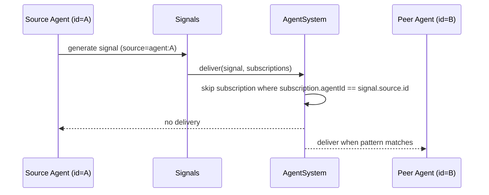

# Agent Signal Feedback Guard

## Summary

Signals emitted with `source={ type: "agent", id: <agentId> }` are no longer delivered to subscriptions owned by the same `<agentId>`.

This prevents self-feedback loops when agents subscribe to patterns that may match their own emitted signals.

Lifecycle signals (`agent:<id>:wake`, `agent:<id>:sleep`, `agent:<id>:idle`) now use agent source (`type=agent`, `id=<agentId>`).

## Delivery Flow

