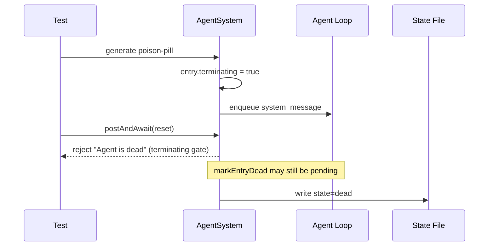

# AgentSystem Poison-Pill Flake

The `agentSystem.spec.ts` poison-pill test was flaky because `postAndAwait(...)` can reject
as soon as `entry.terminating = true`, before the state file is persisted as `dead`.

## Race

## Stabilization

The test now waits for persisted state:

- use `vi.waitFor(...)` around `agentStateRead(...)`
- assert `state === "dead"` only after the async transition is complete

This removes timing-dependent failures (`sleeping` vs `dead`) and cleanup races.
