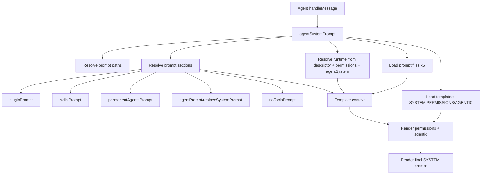

# Agent System Prompt Build

System prompt rendering is centralized in `agentSystemPrompt()` and called from `Agent`.

`Agent` now passes only:
- `descriptor`
- `permissions`
- selected `provider`/`model`
- `agentSystem`

`agentSystemPrompt()` derives connector, cron, app-folder, and feature context internally.

Sections resolved inside `agentSystemPrompt()`:
- plugin context (`pluginManager.getSystemPrompts()`)
- skills prompt (`Skills` + `skillPromptFormat`)
- permanent agents (`agentPermanentList` + `agentPermanentPrompt`)
- agent prompt overrides (`agentPromptResolve`)
- no-tools prompt (`rlmNoToolsPromptBuild`, when enabled)

