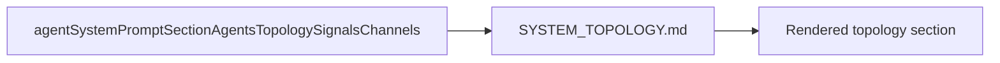
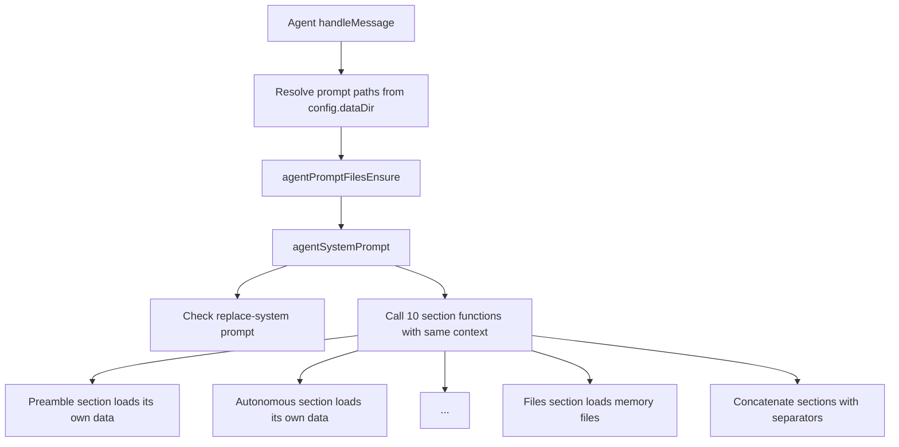

# Agent System Prompt

System prompt rendering is centralized in `agentSystemPrompt()` and called from `Agent`.

`Agent` now passes only:
- `descriptor`
- `permissions`
- selected `provider`/`model`
- `agentSystem`

`Agent` ensures prompt files before prompt rendering using:
- `agentPromptPathsResolve(config.dataDir)`
- `agentPromptFilesEnsure(paths)`

`agentSystemPrompt()` renders deterministic sections by calling section functions with the same `AgentSystemPromptContext` input. Each section loads and renders its own data internally:
- Preamble
- System Environment
- Autonomous operation
- Permissions
- Workspace
- Tool Calling
- Agents, Topology, Signals, Channels
- Skills
- Formatting
- Files

Top-level composition is plain concatenation with section separators (no Handlebars composition step).

Template naming:
- `SYSTEM.md` is the preamble section template.
- All other section templates use the `SYSTEM_*.md` prefix.
- Environment section template is `SYSTEM_ENVIRONMENT.md`.
- Runtime and foreground channel metadata render in `SYSTEM_ENVIRONMENT.md`.
- Agency section template is `SYSTEM_AGENCY.md`.
- Topology section template is `SYSTEM_TOPOLOGY.md`.
- Topology rendering no longer injects `cronTaskIds`; current cron state is expected to be read via the `topology` tool.
- Topology rendering no longer injects `permanentAgentsPrompt`; current agent graph should be read via the `topology` tool.
- `SYSTEM_SKILLS.md` owns mandatory skill-invocation guidance.
- `skillPromptFormat()` now renders only the dynamic `<available_skills>...</available_skills>` list into `skillsPrompt`.

