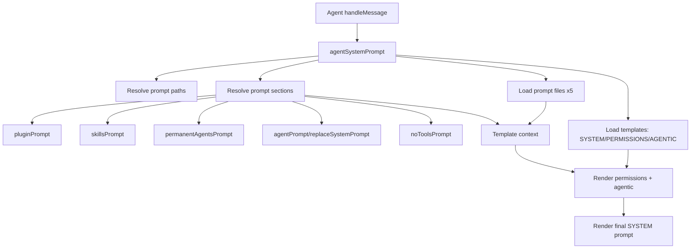

# Agent System Prompt Build

System prompt rendering is centralized in `agentSystemPrompt()` and called from `Agent`.

`Agent` passes runtime metadata plus `agentSystem`; `agentSystemPrompt()` resolves prompt
sections from `agentSystem` in a deterministic order.

Sections resolved inside `agentSystemPrompt()`:
- plugin context (`pluginManager.getSystemPrompts()`)
- skills prompt (`Skills` + `skillPromptFormat`)
- permanent agents (`agentPermanentList` + `agentPermanentPrompt`)
- agent prompt overrides (`agentPromptResolve`)
- no-tools prompt (`rlmNoToolsPromptBuild`, when enabled)

