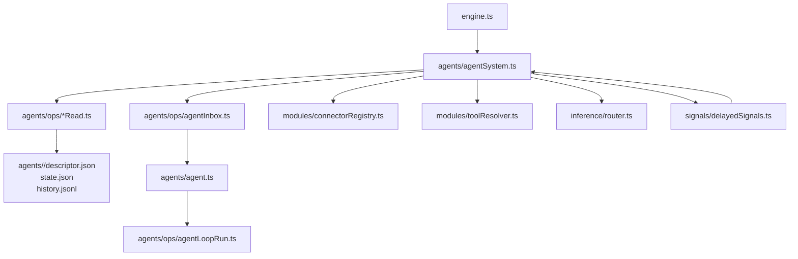

# AgentSystem

AgentSystem owns inbox-backed agent lifecycle:
- load agent descriptors/state with Zod validation + create inboxes
- route posts by agent id or descriptor
- start background agents and dispatch messages
- expose agent info for status/history/reset
- enforce subagent dead-state transitions via delayed poison-pill signals

AgentSystem boots in stages:
1. **load()** scans `agents/<id>/` for `descriptor.json` + `state.json`, creates inboxes, queues restore (no execution)
2. **start()** starts inbox loops for loaded agents and any newly created agents

