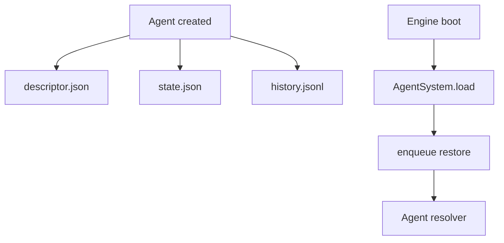
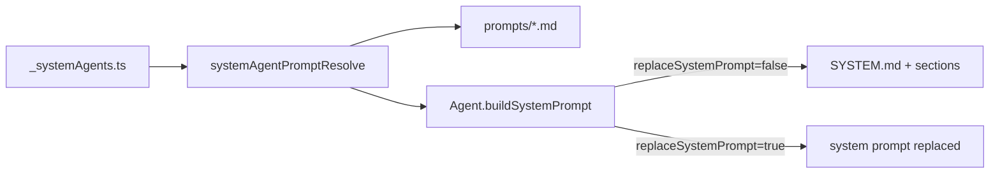
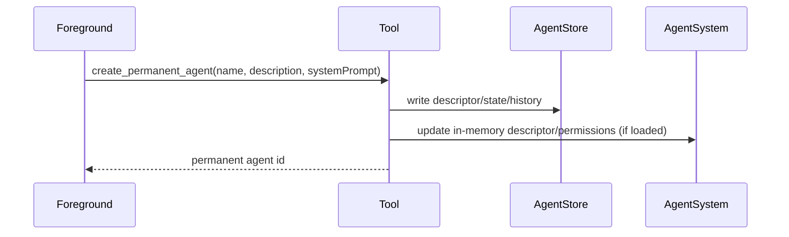
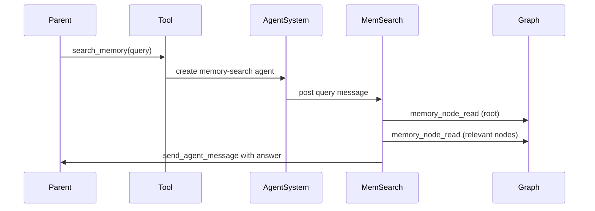
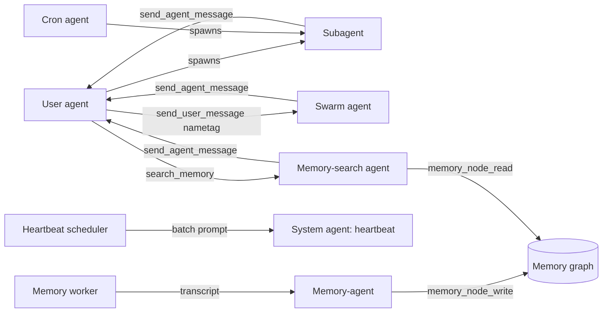
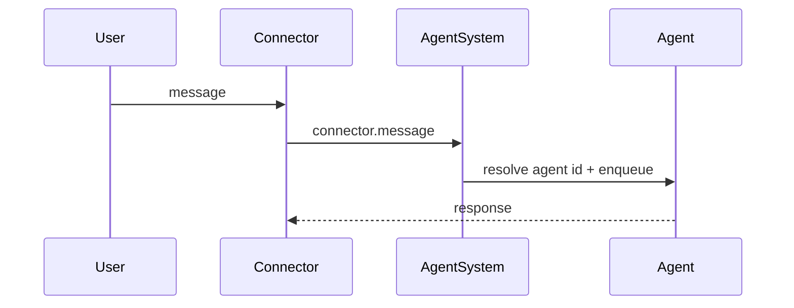
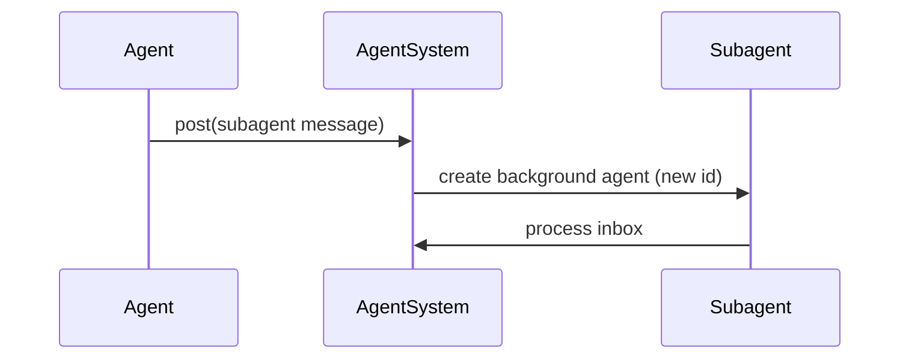
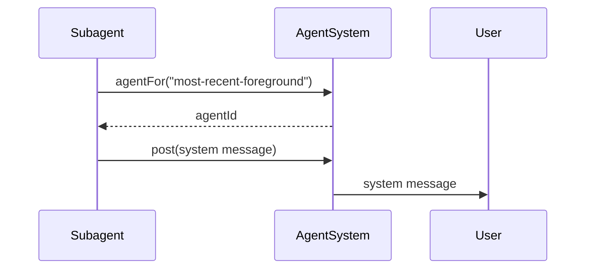
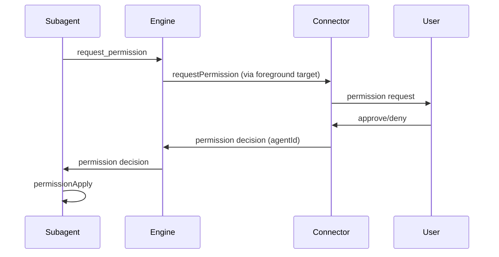

# Agent types

Agent identity is now path-first.

See [agent-paths.md](./agent-paths.md) for the canonical runtime model.

This document is kept for descriptor compatibility details while the migration
window is open. In runtime routing, descriptor targets are normalized to
`AgentPath` before dispatch.



## Descriptor shape

Agent descriptors live in `agents/<id>/descriptor.json`.

```ts
type AgentDescriptor =
  | { type: "user"; connector: string; userId: string; channelId: string }
  | { type: "cron"; id: string }
  | { type: "system"; tag: string }
  | { type: "subagent"; id: string; parentAgentId: string; name: string }
  | { type: "swarm"; id: string }
  | {
      type: "permanent";
      id: string;
      name: string;
      description: string;
      systemPrompt: string;
      workspaceDir?: string;
    }
  | { type: "memory-agent"; id: string }
  | { type: "memory-search"; id: string; parentAgentId: string; name: string };
```

Notes:
- `user` is a foreground connector conversation.
- `cron` maps to a scheduled cron trigger id.
- `system` maps to built-in tag-addressable agents (for example `heartbeat`, `architect`).
- `subagent` is a generic background worker and always includes a parent + name.
- `swarm` is a swarm-side agent identity keyed by swarm user id (`id`).
- `permanent` is a background agent with a stable name, short description, system prompt, and optional workspace folder.
- `memory-agent` extracts observations from session transcripts and writes them to the memory graph.
- `memory-search` navigates the memory graph to answer queries. Spawned via `search_memory` tool. Read-only access to the graph, excluded from memory extraction.

## System agent registry

System agents are defined in a hardcoded list by lowercase tag and prompt file.
Each entry can also opt into full system-prompt replacement.



## Permanent agents

Permanent agents are created via tool calls and persisted like any other agent,
but their descriptors carry a stable name + system prompt for reuse.



## Memory-search agents

Memory-search agents navigate the memory graph to answer queries. They are
spawned via the `search_memory` tool and operate like subagents with a
specialized system prompt.



Key differences from regular subagents:
- System prompt is fully replaced with `MEMORY_SEARCH.md` (read-only graph navigation).
- Tool allowlist: `memory_node_read` plus `send_agent_message` to report results to parent (no write access).
- Sessions are excluded from memory extraction (same as memory-agents).
- Poison-pill scheduling applies (same as subagents).

## Persistence rules

1. On agent creation, the engine writes `descriptor.json` and `state.json`.
2. `history.jsonl` stores minimal `start`/`reset` markers plus user/assistant/tool records.
3. On restart, AgentSystem loads descriptor + state and queues a restore message.
4. History is reconstructed starting after the most recent `start` or `reset` marker.

## Fetch strategies

Only two fetch strategies are supported:

```ts
type AgentFetchStrategy = "most-recent-foreground" | "heartbeat";
```

Resolution behavior:
- `most-recent-foreground` selects the most recent agent with a `user` descriptor.
- `heartbeat` selects the most recent agent with `type: "system"` and `tag: "heartbeat"`.

## How agent types operate together



Operational notes:
- User agents are the only agents treated as foreground.
- Subagents always have a parent (usually a user agent, cron, or a system agent).
- Swarm agents are keyed by `swarm id` and do not use `parentAgentId`.
- Heartbeat runs always map to a single `system:heartbeat` agent that runs a batch prompt.
- Cron agents are scheduled inputs; they can spawn child agents but are not foreground targets.
- Memory-search agents are spawned via `search_memory` tool and have read-only graph access.
- Memory-agents are spawned by the memory worker and have read-write graph access.

## Message delivery

### User message to agent



Delivery notes:
- Agent id is resolved from the persisted `user` descriptor (connector + user + channel).
- The agent inbox preserves ordering; updates are persisted on each step.

### Agent to subagent



Delivery notes:
- Subagents always carry `parentAgentId` and `name`.
- Each subagent starts with a new cuid2 id; existing ids are not reused.
- The subagent descriptor is persisted on creation.

### Subagent back to user



Delivery notes:
- The `most-recent-foreground` strategy selects the most recent `user` agent.
- Child agents (`subagent`/`memory-search`) default to their `parentAgentId`; other agents fall back to
  `most-recent-foreground` when no agent id is provided.

### Permission request via foreground agent

Background agents cannot request permissions directly. They use
`request_permission`, which routes through the most recent foreground agent.



Delivery notes:
- Permission requests include the requesting agent id.
- When a decision arrives, the engine routes it directly to that agent.

## Restore behavior

On startup the engine loads agents from disk and enqueues a restore message.
Restore reconstructs inference context from history after the latest reset/start
marker; it does not retry pending inbound messages.

## Implementation references

- Descriptor type + normalization: `packages/daycare/sources/engine/agents/ops/agentDescriptorTypes.ts`
- System-agent config + prompt resolution: `packages/daycare/sources/engine/agents/system/`
- Persistence ops: `packages/daycare/sources/engine/agents/ops/`
- Resolver + usage: `packages/daycare/sources/engine/agents/agentSystem.ts`
