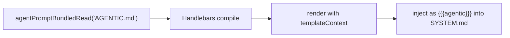

# Agentic Behavior Prompt

`AGENTIC.md` is a bundled prompt template that provides behavioral guidance for agents.
It covers autonomous operation (both agent kinds) and agentic patterns (foreground only).

The template uses Handlebars conditionals (`isForeground`) to tailor guidance
for foreground agents (coordination, subagent delegation) vs background agents
(pure execution, no questions).

## Rendering Pipeline

Follows the same two-stage pattern as `PERMISSIONS.md`:
1. Load and render `AGENTIC.md` with the shared template context (first Handlebars pass)
2. Inject the rendered result into `SYSTEM.md` via `{{{agentic}}}` (second Handlebars pass)

## Location in System Prompt

Appears after Permission Requests and before the Agents section in `SYSTEM.md`.

## Sections

| Section | Audience | Purpose |
|---------|----------|---------|
| Autonomous Operation | Both (conditional) | Drive toward outcomes; foreground decomposes, background executes |
| Agentic Patterns | Foreground only | Batch processing via state files, persistent subagent sessions, permanent agents for ongoing roles |
