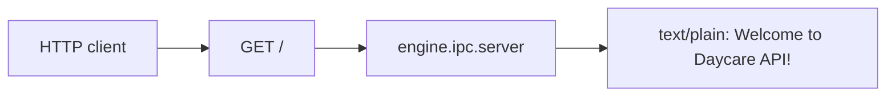

# API Root Welcome Message

The engine IPC API now has an explicit root route (`GET /`) that returns plain text:

```
Welcome to Daycare API!
```

This avoids returning Fastify's default placeholder response and prevents accidentally serving web app content from the API root.



