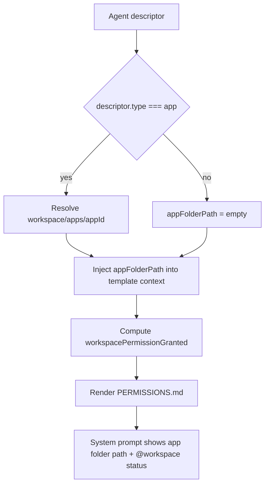

# App Folder Prompt Path

App agents now include their app root directory in the permissions section of the system prompt.
The prompt also shows whether `@workspace` is currently granted.

## What changed

- Added `agentAppFolderPathResolve()` to resolve `<workspace>/apps/<appId>` for app descriptors.
- Added `permissionWorkspaceGranted()` to compute app-visible `@workspace` grant status.
- Passed `appFolderPath` into prompt template context.
- Updated `PERMISSIONS.md` to render both app folder path and `@workspace` grant status.

## Flow

