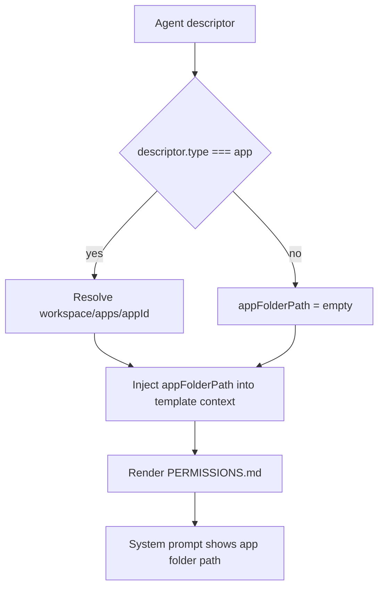

# App Folder Prompt Path

App agents now include their app root directory in the permissions section of the system prompt.

## What changed

- Added `agentAppFolderPathResolve()` to resolve `<workspace>/apps/<appId>` for app descriptors.
- Passed `appFolderPath` into prompt template context.
- Updated `PERMISSIONS.md` to render the app folder path in allowed paths.

## Flow

