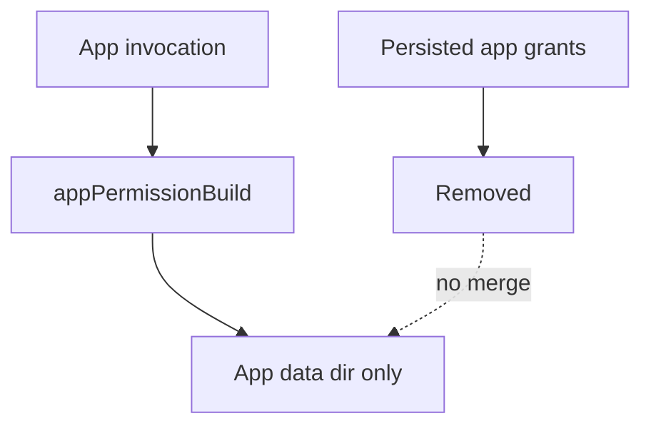

# App Permission Sharing (Removed)

App-level permission persistence/sharing is removed.

## Current behavior

- App runs do not persist granted permission tags.
- `apps/<app-id>/state.json` permission grant storage is not used.
- No `scope: "now" | "always"` permission-request flow exists.

App agents always use fixed app-isolated permissions:

- `workingDir = apps/<app-id>/data`
- `writeDirs = [apps/<app-id>/data]`

