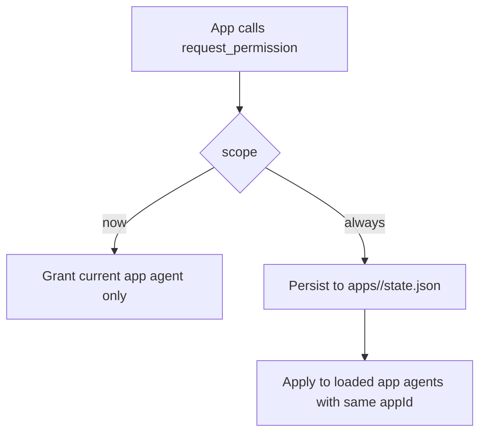
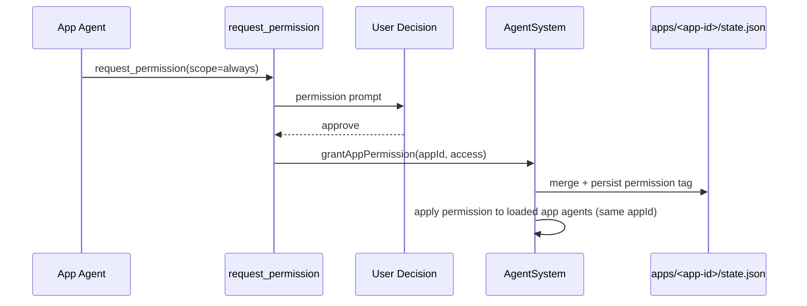
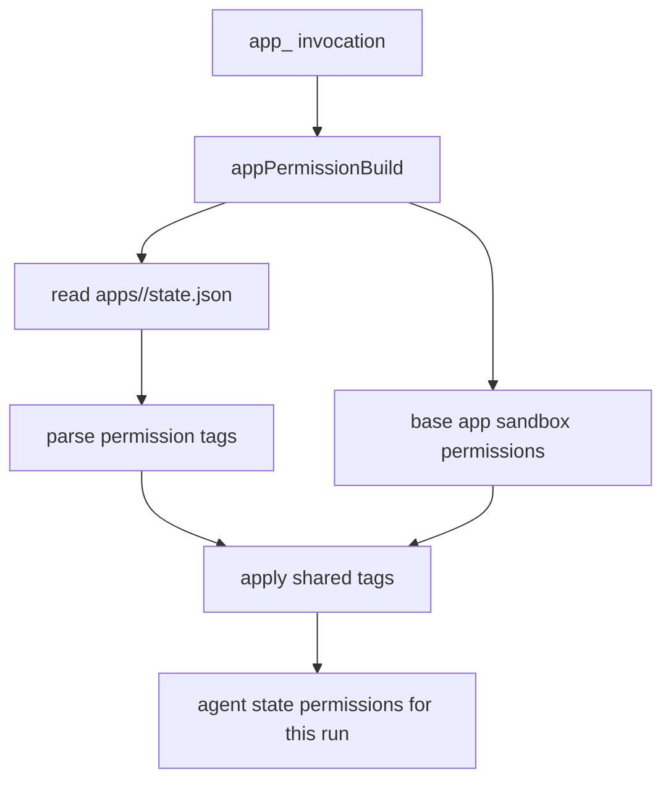

# App Permission Sharing

App permission grants now support app-scoped persistence so app agents can reuse
approved access across invocations.

## Scope model

- `scope: "now"` keeps the grant on the current app agent only.
- `scope: "always"` persists the grant to app-level state and applies it to all
  loaded agents for that app id.
- User-facing prompts render these scopes as:
  - `One time` for `now`
  - `Always` for `always`

## request_permission payload

For app agents, `request_permission` supports explicit scope selection:

- `scope: "now"`: one-time grant for the current app run.
- `scope: "always"`: persist the approved grant for future runs of the same app.

## Persistence

Shared app grants are stored at:

- `<workspace>/apps/<app-id>/state.json`

The file stores normalized permission tags (`@network`, `@read:...`,
`@write:...`) and `updatedAt`.

## Runtime flow

## App invocation startup

