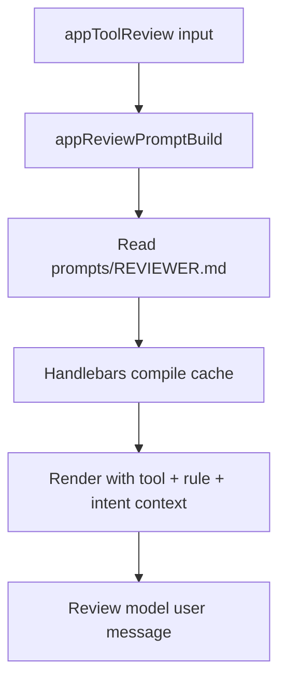

# App Review Tool Context

App review prompts now include the exact set of tools available to the running
app sandbox (name, description, and parameter schema).

This prevents false denials where the reviewer confuses Daycare tool names with
language/runtime built-ins (for example, interpreting tool `exec` as Python
`exec()`).

The review prompt also includes the app's own runtime system prompt so policy
evaluation can account for the app's intended behavior and constraints.

Review prompt text is now sourced from `sources/prompts/REVIEWER.md` and
rendered with Handlebars in `appReviewPromptBuild`.

## Prompt flow

## Prompt additions

- Added section: `## Available Tools In This Sandbox`
- Added tool entries:
  - `Name`
  - `Description`
  - `Parameters` (JSON schema)
- Added section: `## App System Prompt`
- Added section: `## Execution Mode`:
  - when `rlm` is enabled, prompt explicitly states execution flows through `run_python`
    and Python calls can dispatch to the listed tools
  - otherwise prompt states normal direct tool execution
- Added explicit interpretation guard:
  - evaluate against provided tool list only
  - do not reinterpret names by language built-ins

## Template rendering

