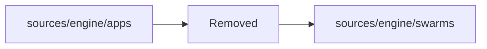

# Apps Internals (Retired)

Legacy app internals (`sources/engine/apps`, `install_app`, `app_rules`) have been removed.

Runtime coordination now lives in the swarms domain:
- `sources/engine/swarms/`
- `swarm_create`
- `send_user_message({ nametag, ... })`

