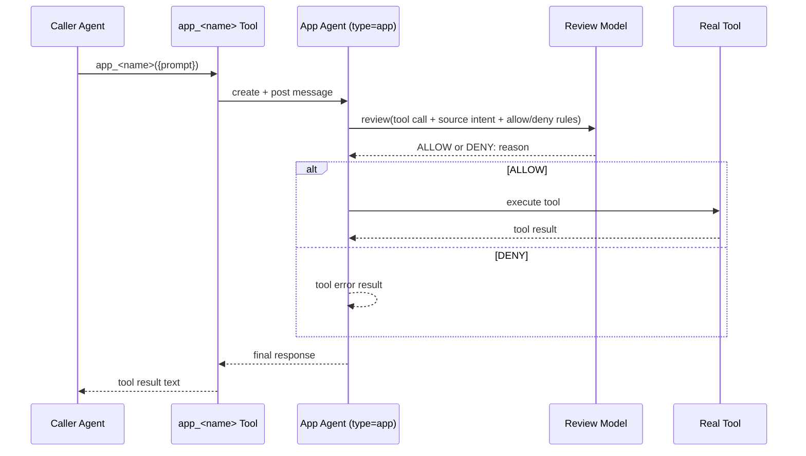

# Apps Internals

Apps are implemented in `sources/engine/apps/` and wired by `engine.ts`.

## Startup Wiring

1. `Engine.start()` registers `install_app` and `app_rules`.
2. `Apps.discover()` scans `<workspace>/apps/*/APP.md` + `PERMISSIONS.md`.
3. `Apps.registerTools()` registers `app_<name>` for each valid descriptor.

## App Invocation

## Permission Model

- App agent `workingDir` and writable area: `<workspace>/apps/<id>/data`
- App agent readable area: workspace root (with app-directory isolation enforcement)
- Non-app agents: denied from `workspace/apps/*`
- Runtime app policy source: `PERMISSIONS.md` (source intent + rules)
- App tool results include the spawned `agentId`; callers can continue with
  `send_agent_message` targeting that id.

## Files

- `appManifestParse.ts` / `appManifestValidate.ts`: APP.md frontmatter + `## System Prompt` parsing and validation
- `appPermissionsParse.ts` / `appPermissionsValidate.ts`: PERMISSIONS.md parsing and validation
- `appDiscover.ts`: app discovery
- `appExecute.ts`: app-agent creation and execution
- `appToolExecutorBuild.ts`: review wrapper around tool execution
- `appInstall.ts`: install from local filesystem source
- `appRuleApply.ts`: mutable PERMISSIONS.md rule updates
