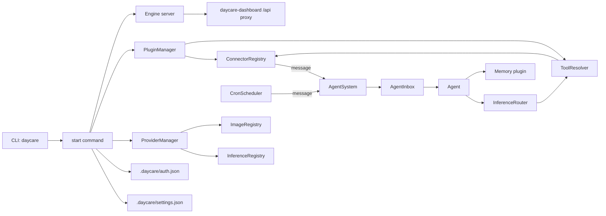

# Architecture

Daycare is a plugin-driven engine that routes connector traffic through agents, inference, tools, and memory.

Key pieces:
- **CLI** (`sources/main.ts`) starts the engine and manages plugins/auth.
- **Plugins** register connectors and tools.
- **Providers** register inference and image generation capabilities.
- **Auth store** (`.daycare/auth.json`) holds provider credentials.
- **File store** persists attachments for connectors and tools.
- **Agent system** routes messages into per-agent inboxes and persists state.
- **Memory plugin** records agent updates and supports queries.
- **Cron scheduler** emits timed messages into agents.
- **Inference router** picks providers from settings.
- **Engine server** exposes a local HTTP socket + SSE for status/events.
- **Dashboard** (`daycare-dashboard`) proxies `/api` to the engine socket.

## Message lifecycle
1. Connector emits a `ConnectorMessage` (text + files).
2. `AgentSystem` routes to an agent and enqueues work in the agent inbox.
3. `Engine` builds a LLM context with attachments.
4. Inference runs with tools (cron, memory, web search, image generation).
5. Responses and generated files are sent back through the connector.
6. Agent state + memory are updated.
