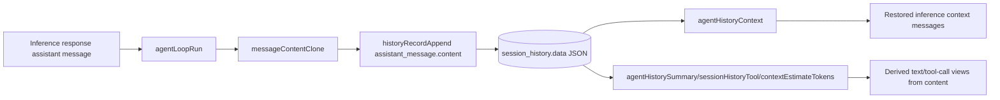

# Assistant History Content Shape

## Summary

`assistant_message` history records now persist full assistant `content` blocks instead of flattened `text` + `toolCalls`.

- Old shape: `assistant_message { text, files, tokens, toolCalls? }`
- New shape: `assistant_message { content, tokens }`

This preserves `thinking` blocks and keeps message ordering/fidelity for restore and replay paths.

## Flow

## Notes

- No backward-compatibility shim is included for old `assistant_message` history blobs.
- Text/tool-call projections are now derived from `content` when needed.
