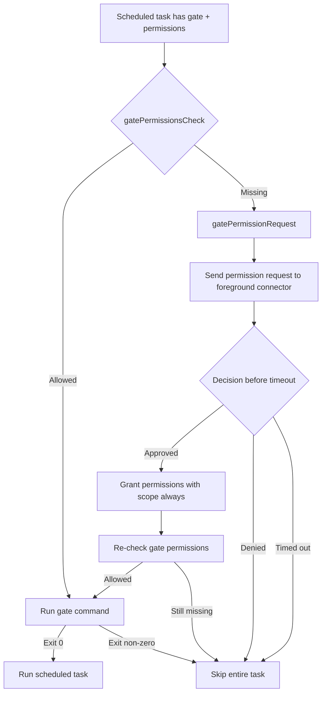

# Auto Gate Permission Request

Gate permissions for heartbeat and cron tasks now request missing permissions from the foreground user instead of silently skipping the gate.

## Behavior
- If all gate permissions are present, gate execution runs as before.
- If permissions are missing, Daycare sends a permission request with `always` scope.
- If approved, permissions are granted to the task agent, permissions are re-checked, and the gate runs.
- If denied or timed out, the entire task is skipped.

## Flow

