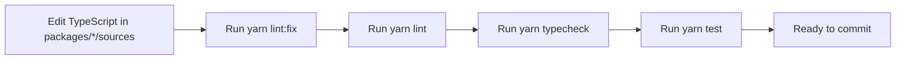

# Biome Code Style

Daycare uses Biome as the single formatter and linter for repository source code.

## Commands

- `yarn lint` runs `biome check`
- `yarn lint:fix` runs `biome check --write`

## Active Style Baseline

- 4-space indentation
- 120 character line width
- double quotes
- semicolons required
- trailing commas disabled

## Scope

Biome checks TypeScript sources in workspace packages:

- `packages/*/sources/**/*.ts`
- `packages/*/sources/**/*.tsx`

## Developer Flow

