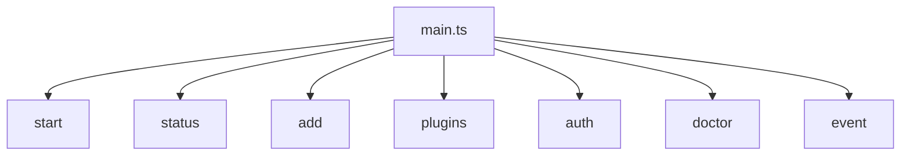
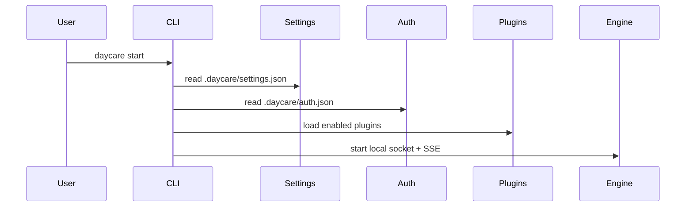
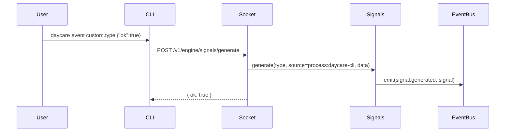

# CLI

The CLI is implemented with Commander in `sources/main.ts`. It always initializes logging first.

## Commands
- `start` - launches the engine (default settings `.daycare/settings.json`).
- `status` - prints engine status if the socket is live.
- `add` - interactive setup for a provider or plugin.
- `plugins load <pluginId> [instanceId]` - loads a plugin instance (updates settings if engine is down).
- `plugins unload <instanceId>` - unloads a plugin instance.
- `auth set <id> <key> <value>` - stores an auth credential.
- `doctor` - runs basic inference checks for configured providers.
- `event <type> [payload]` - generates a custom signal with optional JSON payload over the local socket.

## Development
- `yarn dev` runs the CLI directly via `tsx`.

## start command flow

## event command flow

