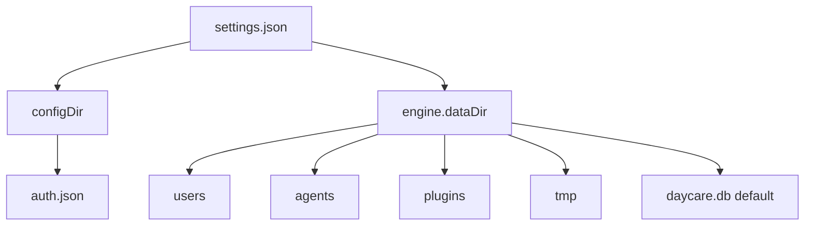

# Config Path Layout

This note documents the current path split between the settings directory and `engine.dataDir`.

## Rule

- user-scoped runtime data lives under `engine.dataDir`
- `auth.json` lives next to `settings.json`

## Layout



## Current Resolution

Given:

```json
{
    "engine": {
        "dataDir": "/srv/daycare/runtime"
    }
}
```

And a settings file at `/srv/daycare/settings.json`:

- `auth.json` resolves to `/srv/daycare/auth.json`
- `usersDir` resolves to `/srv/daycare/runtime/users`
- plugin data resolves under `/srv/daycare/runtime/plugins`
