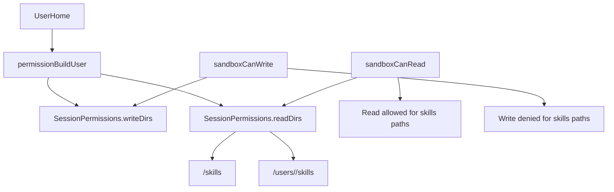

# Config Skills Read-Only Access

User agents now receive explicit read-only access to skills roots while keeping write access unchanged.

## What Changed

- `permissionBuildUser` now sets:
  - `writeDirs = [<user-home>]`
  - `readDirs = [<config>/users/<userId>/skills, <config>/skills]`
- `sandboxCanRead` now treats `readDirs` as explicit read allow-paths.
- `sandboxCanWrite` behavior is unchanged, so skills paths remain non-writable by default.

## Access Flow

