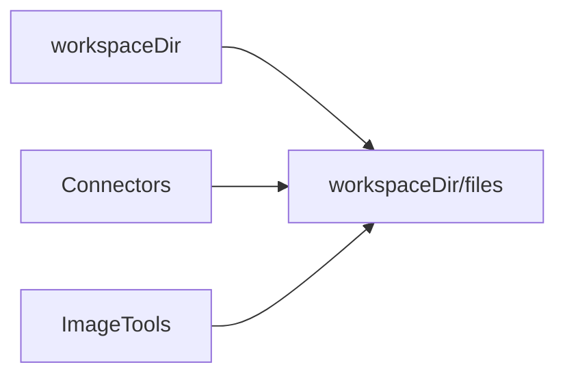

# Config

Daycare uses an immutable Config snapshot that resolves paths, defaults, and settings
from the JSON settings file. The engine reloads by rebuilding a new Config snapshot.

## Snapshot fields

- `settingsPath`, `configDir`, `dataDir`, `filesDir`, `authPath`, `socketPath`, `workspaceDir`
- `settings` (validated settings.json)
- `defaultPermissions`
- `verbose` (runtime flag)

## Lifecycle

```mermaid
flowchart TD
  CLI[CLI writes settings.json] --> Load[configLoad.ts]
  Load --> Config[Config snapshot]
  Config --> Engine[engine.reload()]
  Engine --> Plugins[plugins.manager sync]
  Engine --> Providers[providers.manager sync]
  Engine --> Agents[agentSystem.reload]
  Engine --> Crons[cron facade]
  Engine --> Heartbeats[heartbeat facade]
```

## Reload flow

- CLI or UI updates `settings.json`
- `/v1/engine/reload` validates with schema and rebuilds Config
- Engine applies the new Config snapshot (paths must be unchanged)

## File storage path

`filesDir` resolves to `<workspaceDir>/files` so connector attachments and generated images
are colocated in the workspace.



## Settings defaults
Resolved settings apply defaults so runtime code can rely on non-null values.


