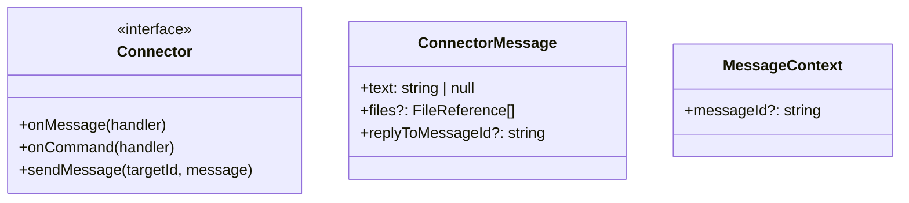
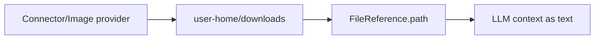
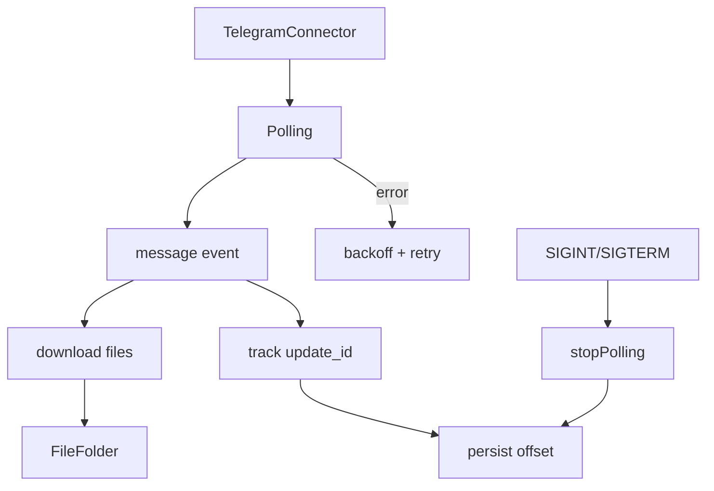
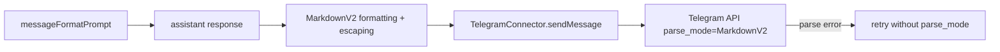
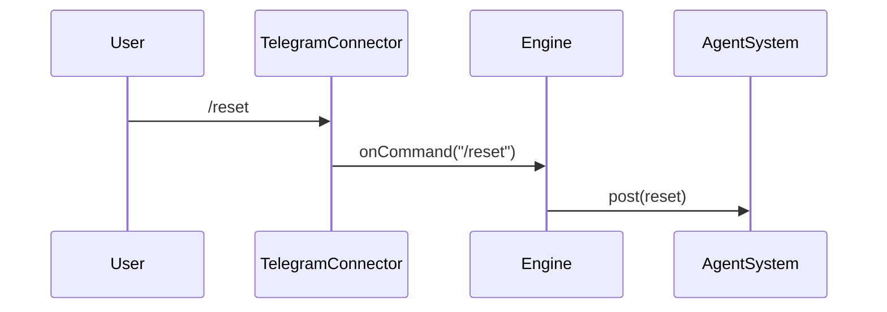
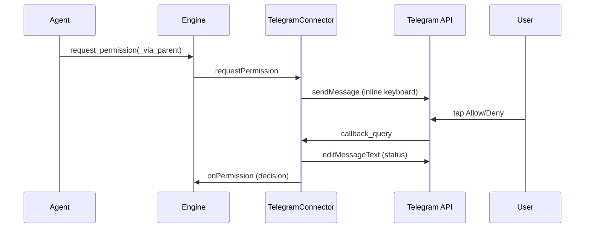

# Connectors

Connectors are plugin modules that bridge Daycare to external systems.
They emit messages (text + files) into agents and send responses back.
Incoming files are persisted on disk and passed to the LLM as file-path references.

## Connector interface
Each connector exposes:
- `onMessage(handler)` to receive `ConnectorMessage` events.
- `onCommand(handler)` to receive command text events.
- `sendMessage(targetId, message)` to respond (including files).

Messages are normalized to:
```
{ text: string | null, files?: FileReference[], replyToMessageId?: string }
```
The LLM-facing user message references `FileReference.path` and never embeds raw file bytes.



Connectors emit a user descriptor alongside `MessageContext` for agent targeting.

## File transport policy

- Connectors persist received files via `FileFolder` (typically user `home/downloads`).
- Image generation tools write output files to the active `ToolExecutionContext.fileStore`.
- LLM context includes file metadata + path only; no inline base64/image payloads.



## Telegram connector
- Implemented as the `telegram` plugin.
- Uses long polling by default.
- Persists `lastUpdateId` to `.daycare/telegram-offset.json`.
- Downloads incoming files into the user-scoped downloads folder.
- Sends images/documents when tool results include files.
- Supports chat actions (typing) and reactions.
- Outgoing text uses MarkdownV2 parse mode.



## Telegram message formatting
- Connector prompts the model to follow MarkdownV2 rules.
- Permission prompts are formatted with MarkdownV2-safe escaping.
- If Telegram rejects a message due to parsing, the connector retries without `parse_mode`.



## Telegram commands
- `/reset` clears the agent message history for the current user.
- `/context` reports the latest context token usage snapshot.
- `/compact` requests manual context compaction.
- `/abort` aborts the current inference for the current user.
- Upgrade plugin commands may add `/upgrade` and `/restart` when that plugin is enabled.



## Telegram permissions
- Permission prompts render with inline buttons and are edited in-place after a decision.
- Background agents call `request_permission`, but Telegram still receives the same
  `requestPermission` call from the engine (routed via the most recent foreground agent).


