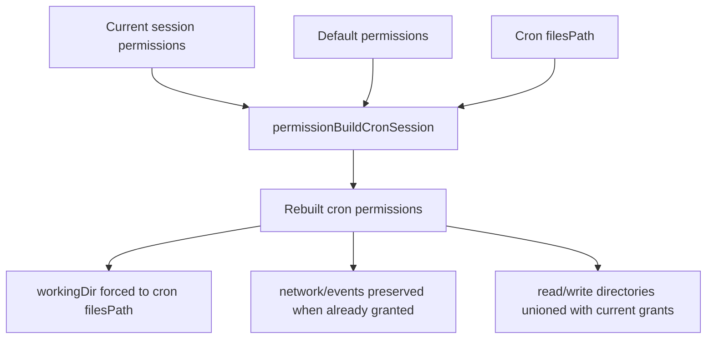

# Cron Permission Refresh

## Summary

Cron agents rebuild their workspace permissions before each message so they run in the task files directory. Previously this reset dropped runtime-granted permissions (for example `@network`) because the rebuild started only from default permissions.

The fix keeps cron workspace enforcement while carrying forward already granted runtime permissions.

## Flow

