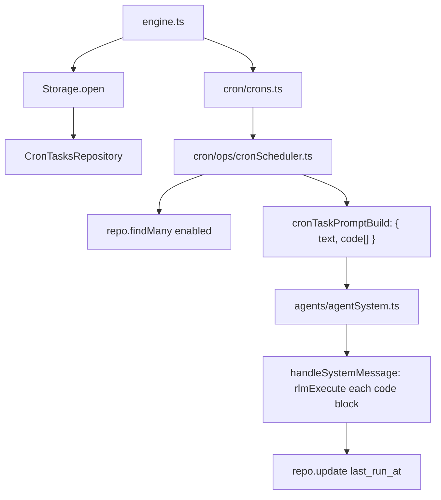

# Cron scheduler

Cron tasks store Python code in SQLite and are loaded at startup.

## Task storage

Rows live in `tasks_cron`:
- `id` (task slug)
- `task_uid` (cuid2 descriptor id)
- `name`, `description`, `schedule`, `code` (Python code)
- `agent_id`, `user_id`
- `enabled`, `delete_after_run`
- `last_run_at` (unix ms)

## Execution model

- `Crons` wires `CronScheduler` with `CronTasksRepository`.
- `CronScheduler` loads enabled rows and schedules next runs.
- For each due task, `cronTaskPromptBuild` returns `{ text, code[] }` with cron metadata and Python code.
- The message is posted as `system_message` with `code[]` array and `execute=true`.
- `handleSystemMessage` executes each code block directly via `rlmExecute`.
- After execution, `last_run_at` is persisted back to SQLite.

## Tools

- `cron_add` creates/updates a task with Python code
- `cron_read_task` reads task details and code
- `cron_delete_task` removes task row + in-memory schedule
