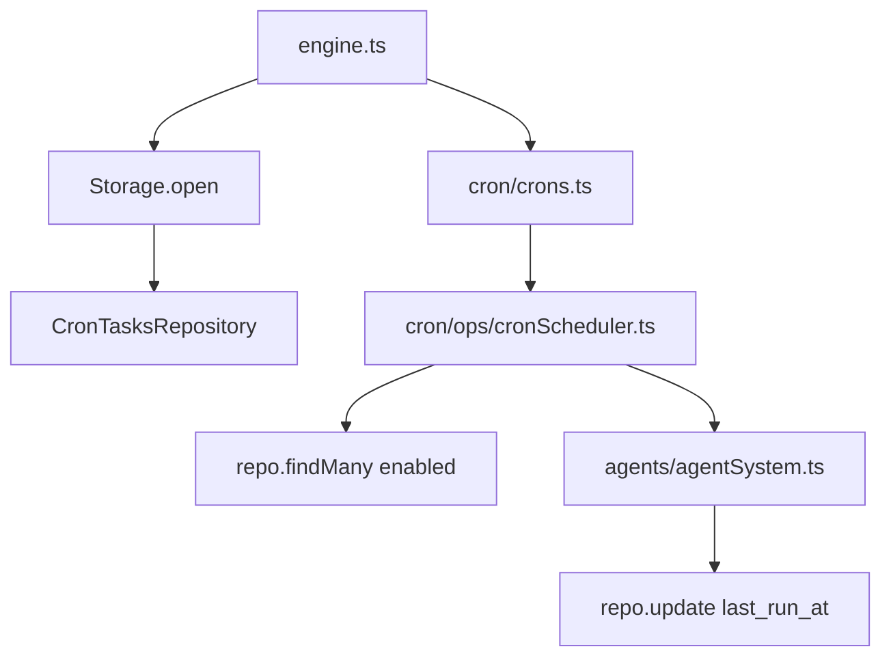

# Cron scheduler

Cron tasks are stored in SQLite and loaded at startup. Cron no longer stores task-local `MEMORY.md` or `files/` workspaces.

## Task storage

Rows live in `tasks_cron`:
- `id` (task slug)
- `task_uid` (cuid2 descriptor id)
- `name`, `description`, `schedule`, `prompt`
- `agent_id`, `user_id`
- `enabled`, `delete_after_run`
- `last_run_at` (unix ms)

## Execution model

- `Crons` wires `CronScheduler` with `CronTasksRepository`.
- `CronScheduler` loads enabled rows and schedules next runs.
- For each due task, the prompt is posted as `internal.cron.task`.
- After execution, `last_run_at` is persisted back to SQLite.

## Tools

- `cron_add` creates/updates a task row
- `cron_read_task` reads task details
- `cron_delete_task` removes task row + in-memory schedule
