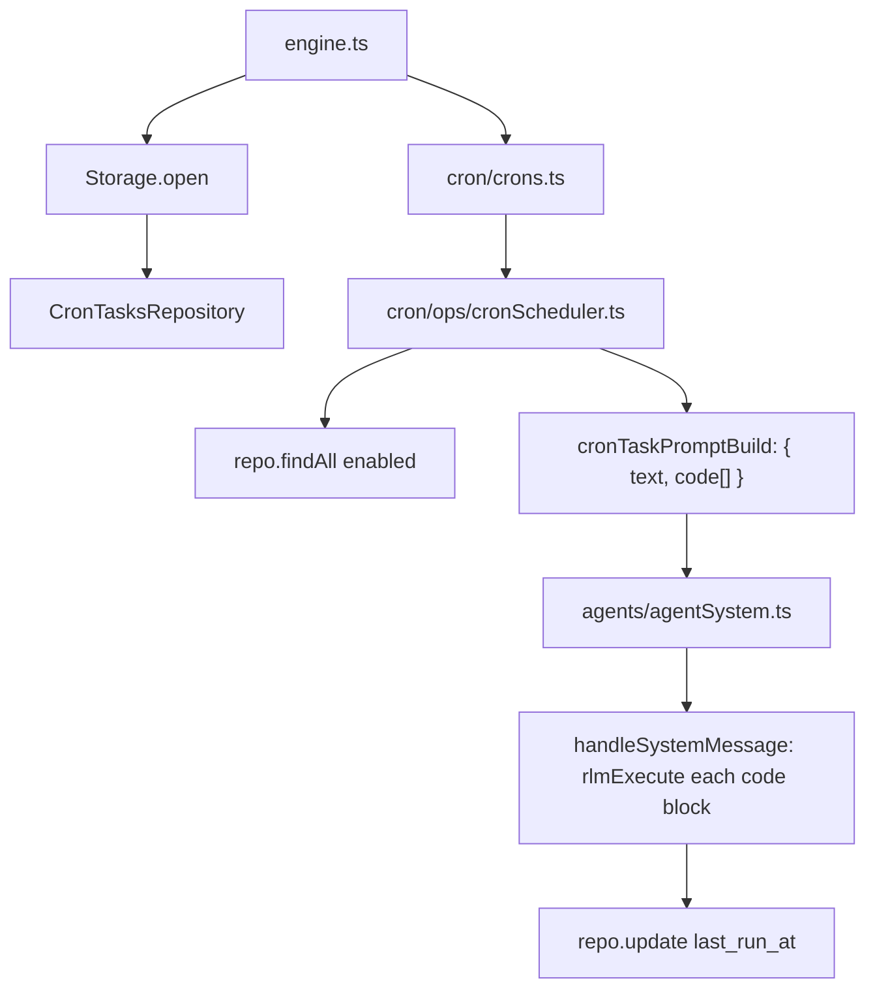

# Cron scheduler

Cron tasks store Python code in SQLite and are loaded at startup.

## Task storage

Rows live in `tasks_cron`:
- `id` (trigger id; `cuid2` by default)
- `task_id` (required FK to `tasks.id`)
- `name`, `description`, `schedule`, `code` (Python code)
- `agent_id`, `user_id`
- `enabled`, `delete_after_run`
- `last_run_at` (unix ms)

## Execution model

- `Crons` wires `CronScheduler` with `CronTasksRepository`.
- `CronScheduler` loads enabled rows and schedules next runs.
- Runtime code/title are resolved from `tasks` through `task_id`.
- For each due task, `cronTaskPromptBuild` returns `{ text, code[] }` with cron metadata and Python code.
- The message is posted as `system_message` with `code[]` array and `execute=true`.
- `handleSystemMessage` executes each code block directly via `rlmExecute`.
- After execution, `last_run_at` is persisted back to SQLite.

## Tools

- `task_create` creates task rows and optional cron triggers
- `task_read` reads task details and trigger links
- `task_trigger_add` adds cron triggers to existing tasks
- `task_trigger_remove` removes cron triggers
