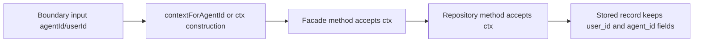

# Ctx Parameter Convention

## Purpose
Use a single `Context` object (`ctx`) for function and method identity parameters instead of passing `userId` and `agentId` separately.

## Rules
- Prefer `ctx` in internal service/facade/repository APIs.
- Keep raw `agentId`/`userId` strings at boundaries where identity enters the system:
  - CLI argument parsing
  - IPC/HTTP payloads
  - persisted DB record fields
- Normalize `ctx.userId` and `ctx.agentId` at API entry points.

## Migrated Examples
- `signals.subscribe({ ctx, pattern, silent })`
- `signals.unsubscribe({ ctx, pattern })`
- `channels.addMember(channelName, ctx, username)`
- `channels.removeMember(channelName, ctx)`
- `delayedSignalsRepository.deleteByRepeatKey(ctx, type, repeatKey)`
- `delayedSignalsRepository.findAll(ctx?)`

## Parameter Patterns
- Use object parameters when the API has multiple named options or optional fields:
  - `signals.subscribe({ ctx, pattern, silent })`
  - `signals.unsubscribe({ ctx, pattern })`
- Use positional parameters for small, required argument sets:
  - `channels.addMember(channelName, ctx, username)`
  - `channels.removeMember(channelName, ctx)`
- When `ctx` is optional, callers can omit it only for unscoped/system-wide reads:
  - `delayedSignalsRepository.findAll()` returns all records
  - `delayedSignalsRepository.findAll(ctx)` returns user-scoped records
  - `delayedSignalsRepository.deleteByRepeatKey(ctx, ...)` requires `ctx`; blank `ctx.userId` is treated as no-op
- For positional signatures, keep `ctx` early (typically first or second argument).

## Identity Flow

