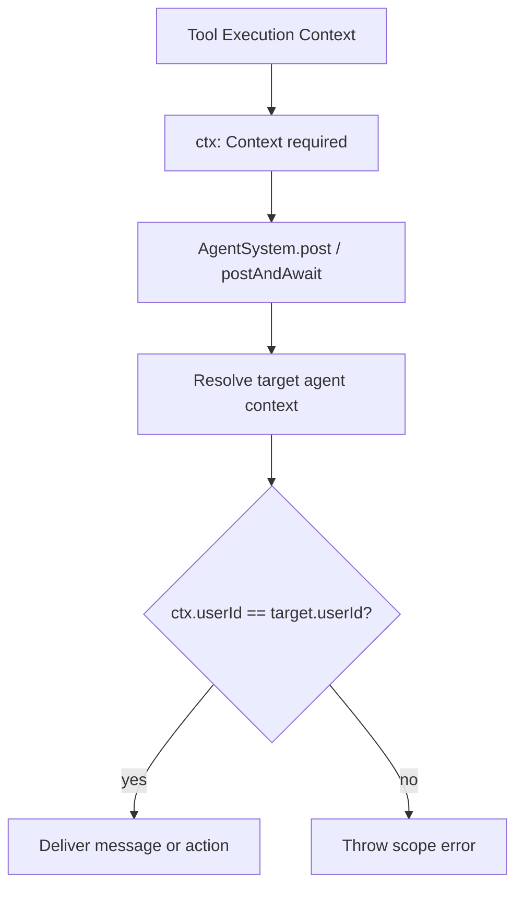
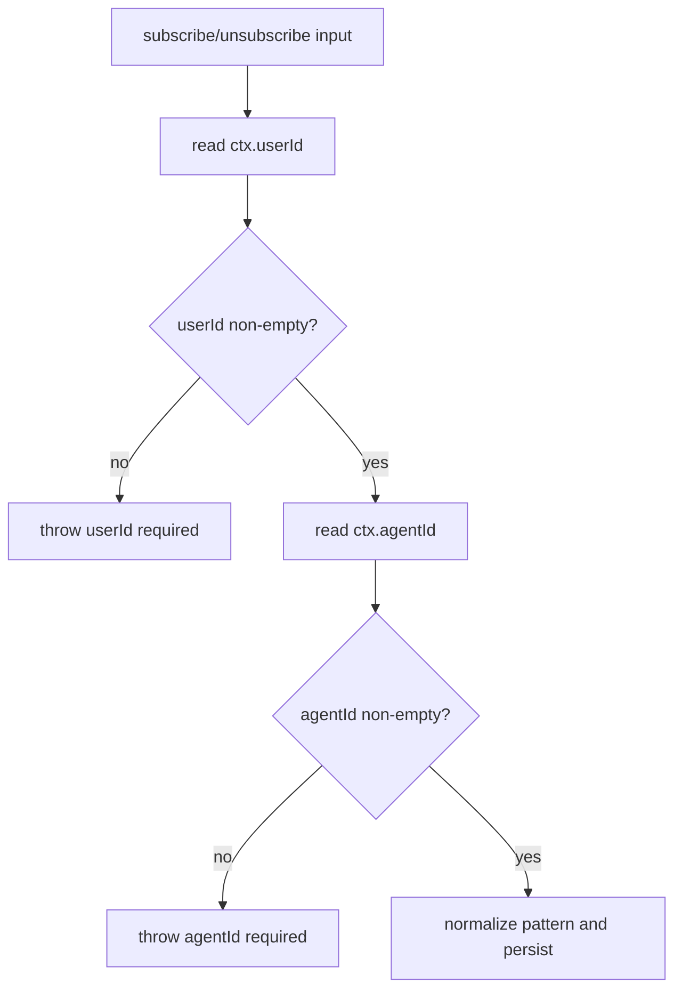

# Context-Required Routing and Scope Checks

This update finalizes strict context (`ctx`) usage for cross-agent operations and tool execution paths.

## Rules
- `ctx` is required for tool execution and agent routing (`post`, `postAndAwait`, `agentIdForTarget`, `agentFor`, `steer`).
- User identity comes from `ctx.userId`; no owner fallback is allowed.
- Empty `userId` is rejected; unresolved user identity throws.
- Cross-agent operations verify user scope using `ctx.userId`.

## Main Flow

## Signal Subscription Validation

