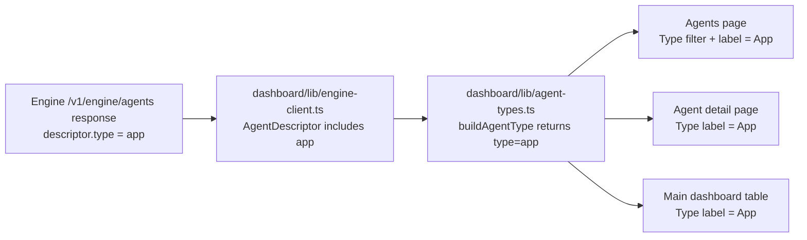

# Dashboard app agent type support

## Summary
The dashboard now treats `descriptor.type: "app"` as a first-class agent type.

- `engine-client` accepts app descriptors from `/v1/engine/agents`.
- `buildAgentType` maps app descriptors to an explicit `AgentType` variant.
- Agents list, agent detail, and dashboard table render app descriptors and labels as `App`.

## Flow

