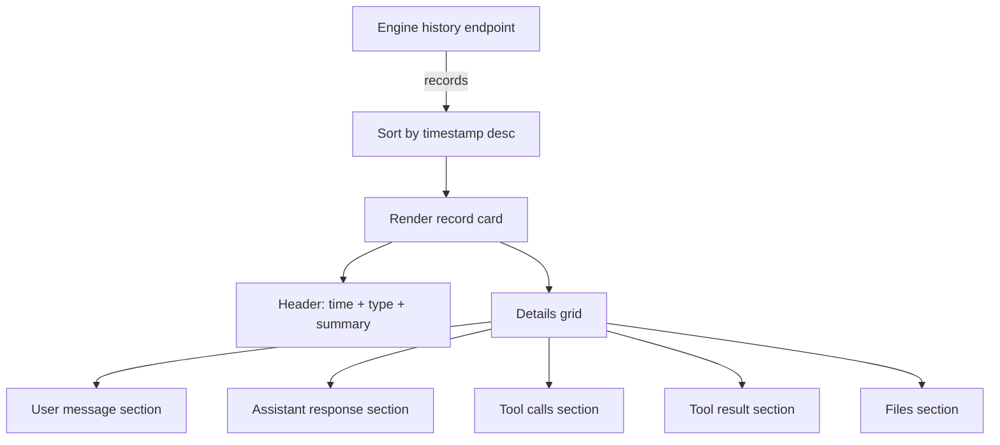

# Daycare Dashboard History Detail

The agent detail page now renders a structured history stream, expanding each record into a readable, inspectable layout. Each record shows timestamp, type, and a summary line, plus dedicated sections for messages, tool calls, tool outputs, and files.

## Layout Summary
- Records are grouped as stacked cards with a color accent by type.
- Each card contains: header metadata, summary, and a details grid.
- Tool calls show their id, name, type, and the arguments JSON.
- Tool results show metadata plus the full tool message payload.
- File sections list name, size, mime type, and storage path.

## Data Flow

