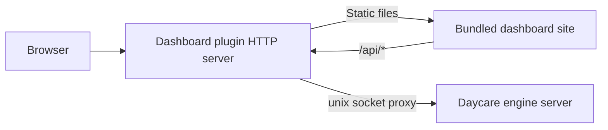
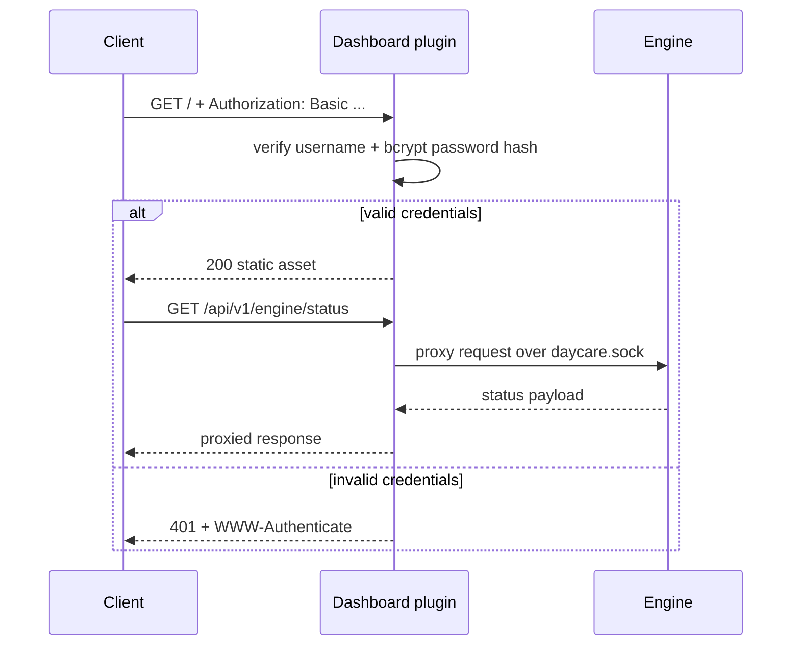

# Dashboard Plugin

The `dashboard` plugin runs a local dashboard server fully inside `daycare-cli`.

It serves bundled static assets and proxies `/api/*` requests to the engine unix socket.

## Runtime flow

## Authentication flow

If `basicAuth` is configured in plugin settings, every dashboard request requires HTTP Basic auth.

## Onboarding

`daycare add` -> `Plugin` -> `Dashboard` onboarding prompts for:
- host
- port
- whether basic auth should be enabled
- generated secure password or user-provided strong password

The plugin stores only a bcrypt password hash in plugin settings.
