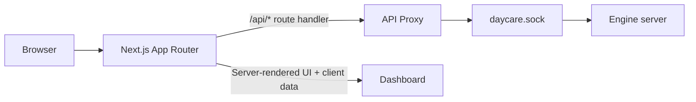
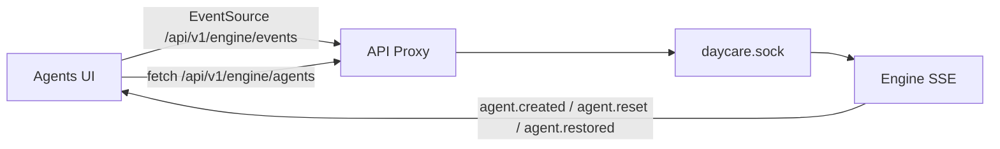
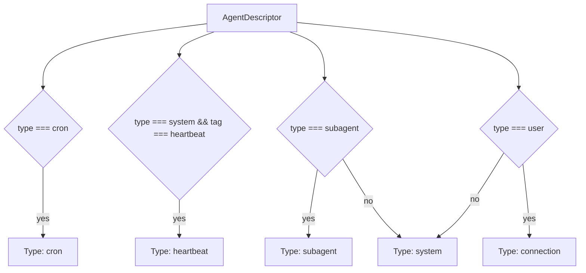
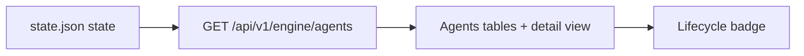
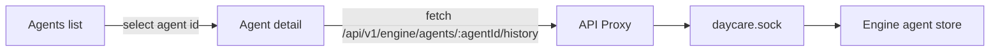
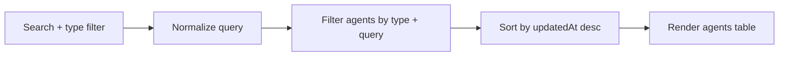
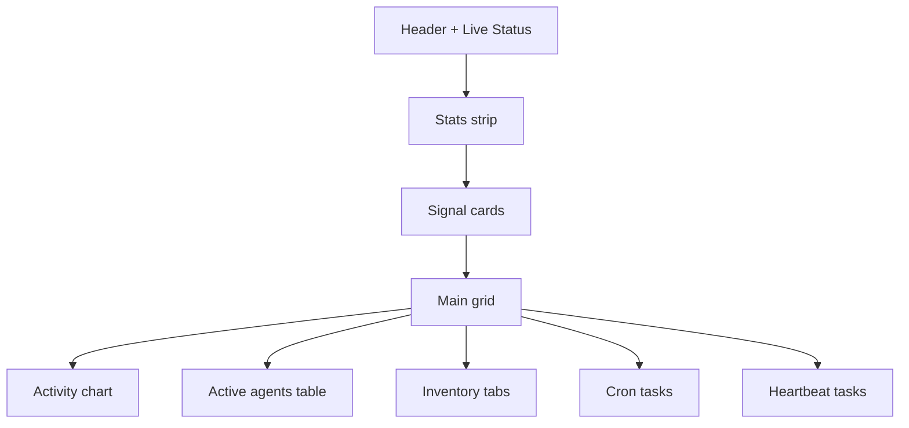
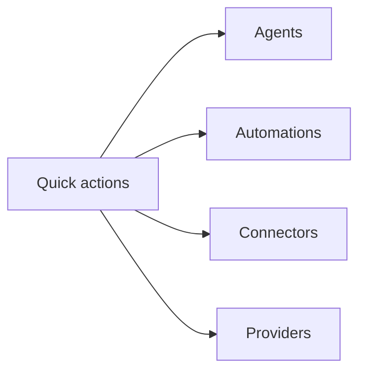
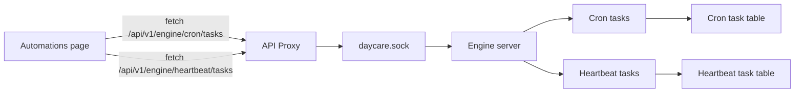
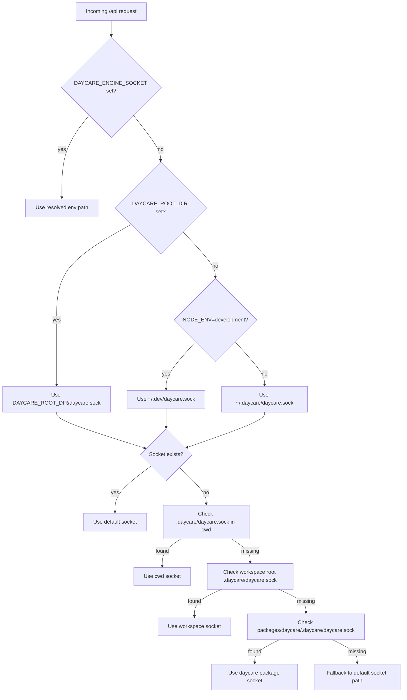

# Daycare dashboard

`daycare-dashboard` is a Next.js app router UI styled with shadcn components.
API route handlers proxy `/api/*` requests to the local engine socket.

For npm-installed `daycare-cli`, the built-in `dashboard` plugin serves a bundled static UI and proxy directly from the CLI runtime. The Next.js app in `packages/daycare-dashboard` remains the development dashboard server.

Default port: `7331` (set via `PORT` in the workspace scripts).

## Agents streaming

The agents views subscribe to the engine event stream and refresh agent data when agent events arrive.

## Agent type object

Agents display a computed type object so the UI can distinguish connections, scheduled work,
and subagent children.

## Agent lifecycle badges

Agent lifecycle state (active vs sleeping) is fetched from the agent list and displayed as
badges in the agents tables and detail view.

## Agent detail navigation

Agent rows link to a dedicated detail page that loads the history for that agent.

## Agent list filtering

The agents page filters by type and search query before rendering the table.

## Overview layout

The overview page blends a stats strip, signal cards, and live panels.

## Quick actions

Action cards jump to the most used operational screens.

## Automations task views

The automations screen fetches both cron and heartbeat task lists on refresh and renders dedicated views for each.

## Engine socket resolution

The dashboard proxy prefers an explicit socket override. If none is set, it resolves a default
daycare root (DAYCARE_ROOT_DIR, or `~/.dev` in development, or `~/.daycare` otherwise) and then
falls back to common workspace locations.

