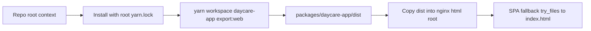

# Daycare App Docker Web Build

Updated `packages/daycare-app/Dockerfile` to build the Expo web app from the monorepo workspace and serve the static output with nginx.

## Build and runtime flow

## Notes

- Builder now uses Node 22 to match runtime baseline.
- Docker build expects repository-root context so workspace dependency resolution works.
- Export sets `EXPO_PUBLIC_BASE_URL="/"` for root-hosted web deployment.
