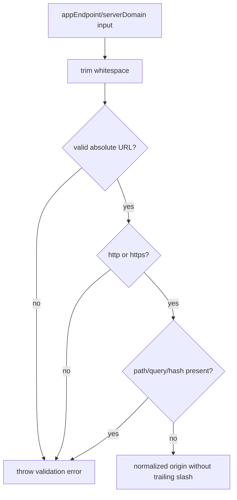

# Daycare App Endpoint Normalization

`appEndpoint` and `serverDomain` are treated as endpoint URLs (not bare domains).

- Accepts only absolute `http://` or `https://` endpoints.
- Removes trailing slash when provided.
- Rejects paths, query strings, and hash fragments.
- Defaults `appEndpoint` to `https://daycare.dev` when not configured.

This normalization is applied in both app-link CLI option resolution and app auth link URL generation.

