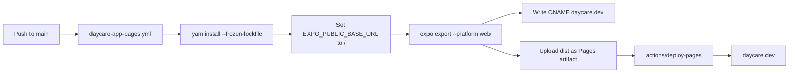

# Daycare App GitHub Pages Publishing

Added a dedicated GitHub Actions workflow to publish the Expo web build of `packages/daycare-app` to GitHub Pages.

## Deployment flow

## Notes

- `app.config.js` reads `EXPO_PUBLIC_BASE_URL` and forwards it to Expo `experiments.baseUrl`.
- Workflow now exports with `EXPO_PUBLIC_BASE_URL="/"` for custom-domain root hosting at `daycare.dev`.
- Workflow writes `dist/CNAME` with `daycare.dev`.
- The workflow writes `dist/.nojekyll` so static assets and underscore-prefixed paths are served as-is.
- Publishing runs automatically on `main` changes affecting `packages/daycare-app` and can also be started manually with `workflow_dispatch`.
