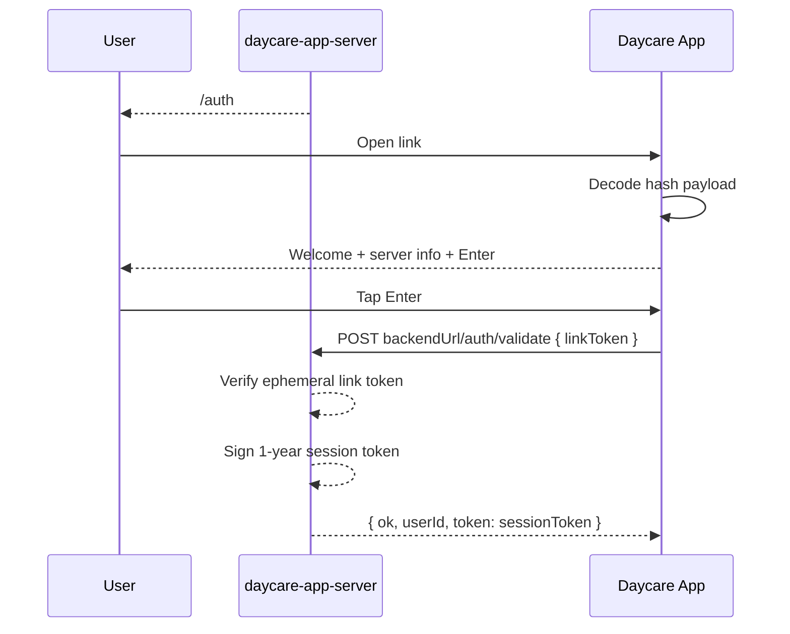

# Daycare App Hash Link Auth

The app auth link now carries backend configuration in the URL hash so the web app is backend-agnostic at runtime.

- Link format changed from query token to hash payload.
- Hash payload is URL-safe base64 JSON with `backendUrl` and `token`.
- Link token is ephemeral (default: 1 hour) and exchanged on `/auth` to a long-lived session token.
- Auth screen now shows server details and requires explicit `Enter` before validation.
- Stored auth session now persists `{ baseUrl, token }` together.

