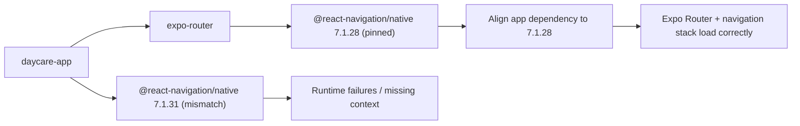

# Daycare App Navigation Resolution

After upgrading Expo SDK 55, `expo-router` pins `@react-navigation/native@7.1.28`.
Using a newer app-level version (`7.1.31`) caused incompatible package layouts and context/runtime failures.

