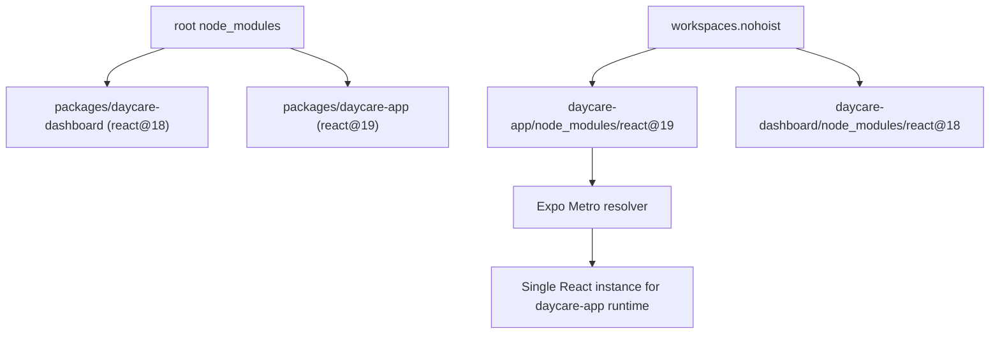

# Daycare App React Resolution via Nohoist

This repo now uses Yarn v1 `workspaces.nohoist` for `react`, `react-dom`, and `react-native`.
The goal is to keep app runtime dependencies local to each workspace and avoid mixed React versions in Metro.

