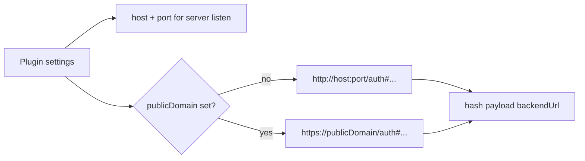

# Daycare App Public Domain Link Generation

The `daycare-app-server` plugin now supports `publicDomain` for `/app` and `app_auth_link` URL generation.

- Server bind still uses `host` + `port`.
- Generated link host uses `publicDomain` when present.
- Hash payload `backendUrl` also uses the same public value so app auth calls target the public endpoint.

