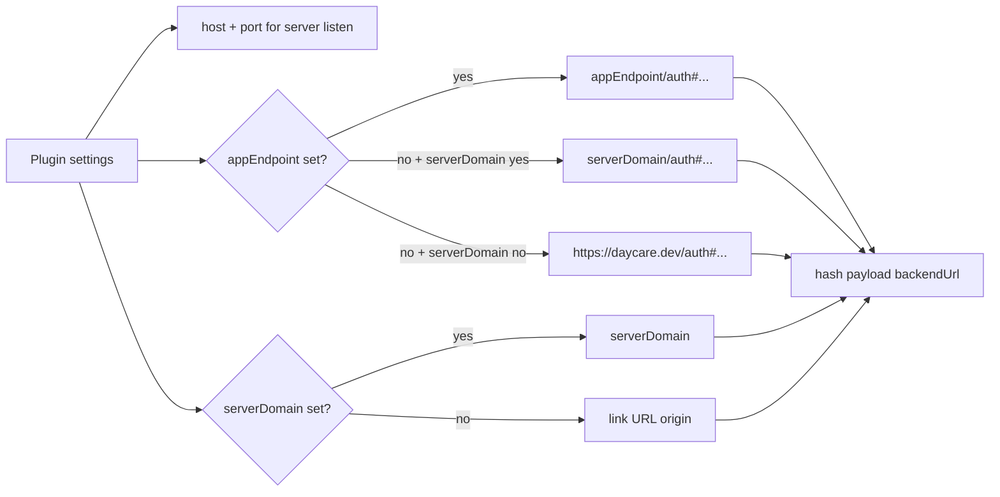

# Daycare App Split-Domain Link Generation

The `daycare-app-server` plugin supports separate link endpoints for `/app` and `app_auth_link` URL generation.

- Server bind still uses `host` + `port`.
- Generated link host uses `appEndpoint` endpoint (default `https://daycare.dev`) when `serverDomain` is not set.
- Hash payload `backendUrl` uses `serverDomain` endpoint when present.
- Endpoints must be full `http(s)` URLs. Trailing slashes are trimmed.

