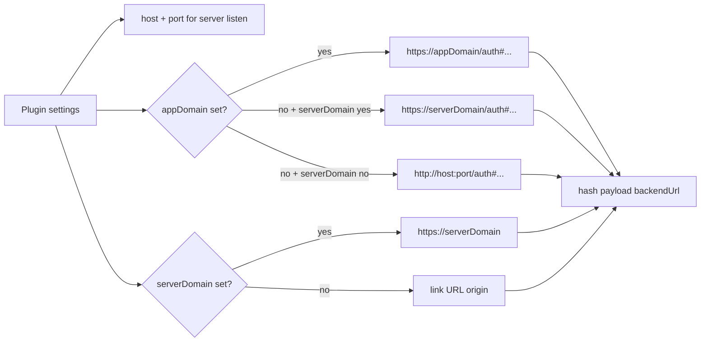

# Daycare App Split-Domain Link Generation

The `daycare-app-server` plugin supports separate link domains for `/app` and `app_auth_link` URL generation.

- Server bind still uses `host` + `port`.
- Generated link host uses `appDomain` when present.
- Hash payload `backendUrl` uses `serverDomain` when present.

