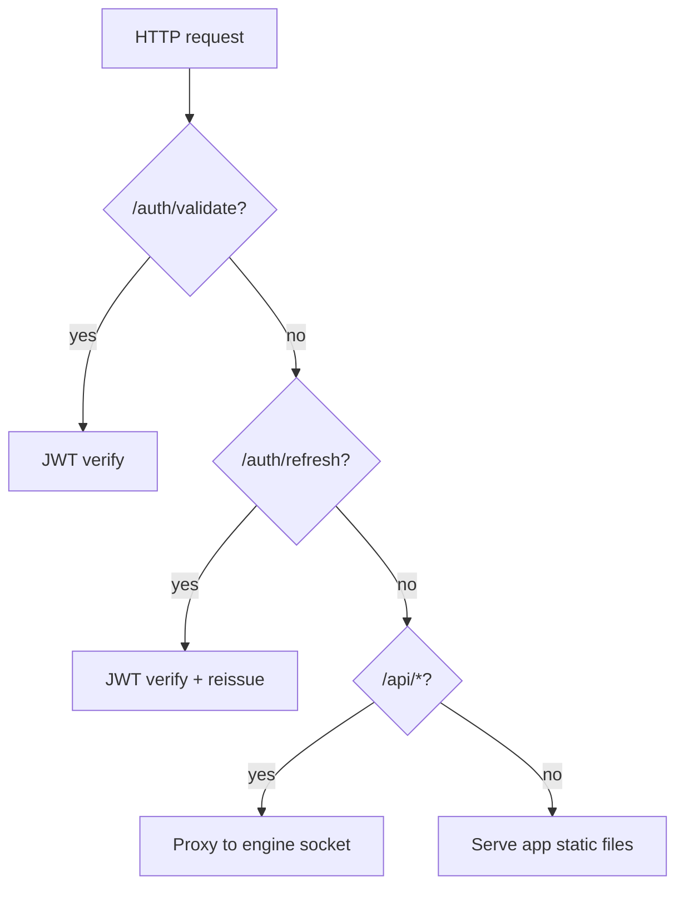
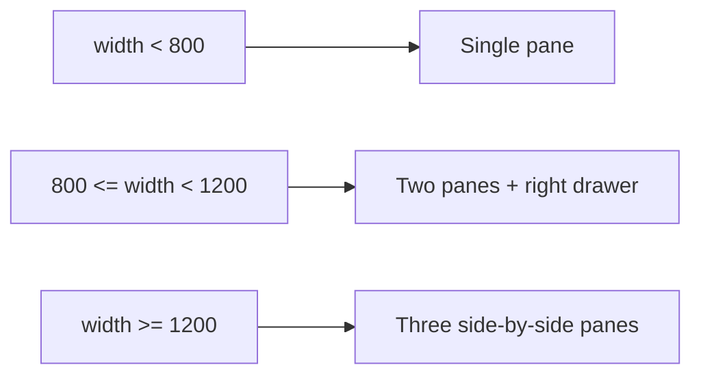
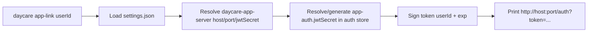
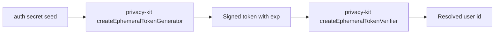

# Daycare App Scaffold

Implemented scaffold for a new Expo app package and matching runtime plugin.

## Runtime integration

```mermaid
flowchart LR
    User[User sends /app] --> Command[/app slash command]
    Command --> Plugin[daycare-app-server]
    Plugin --> JWT[Sign token userId + exp]
    JWT --> Link[http://host:port/auth?token=...]
    Link --> App[Daycare Expo app]
    App --> Validate[POST /auth/validate]
    Validate --> Plugin
    Plugin --> Shell[Authenticated 3-pane shell]
```

## Plugin request routing



## App shell layout behavior



## CLI link generation

`daycare app-link <userId>` now generates the same magic link URL format used by `/app` and `app_auth_link`.



## Token stack

App link tokens are signed and verified via `privacy-kit` ephemeral tokens (Ed25519 signatures, service-scoped seed derivation).


